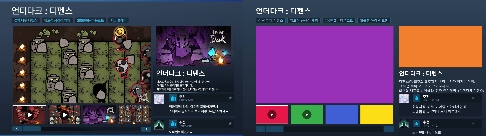
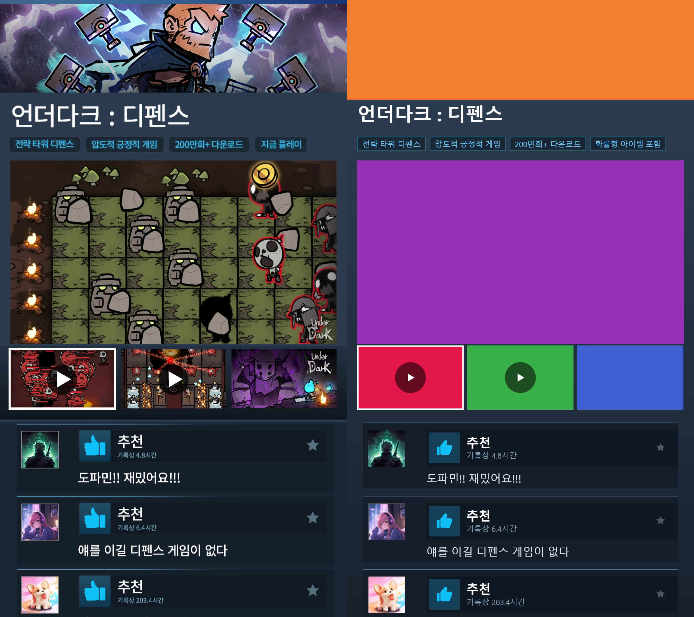
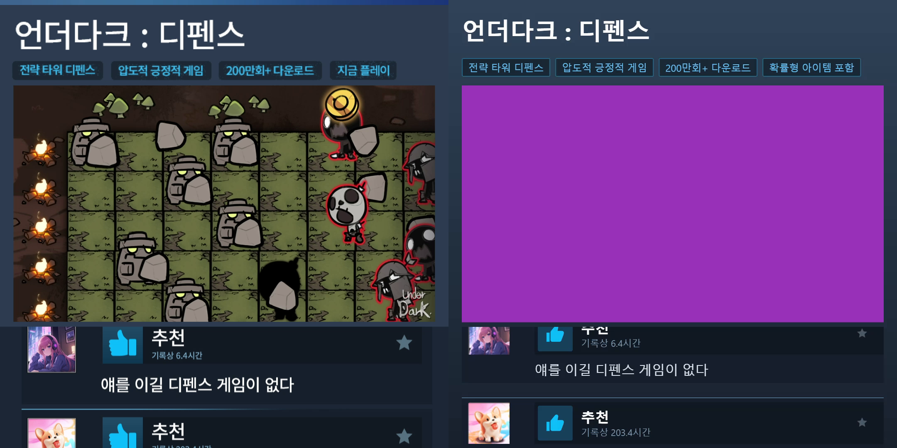

# steam-review Gap Analysis — 스팀 상점 페이지 목업 템플릿 (Check)

> **Summary**: Design(D-1~D-7, §3~§12) 대 구현을 3층(PRD 없음 → Plan → Design)으로
> 대조했다. 감사 시점 Match Rate **94%**(gap-detector, 66항목), Check 중 Important
> 4건을 조치해 **최종 95%** — 잔여는 Minor 코드 정리 4건과 NFR 성능 1건.
>
> **Project**: mkt_videodesigner
> **Feature key**: `steam-review`
> **Date**: 2026-08-28
> **Plan**: [steam-review.plan.md](../01-plan/features/steam-review.plan.md)
> **Design**: [steam-review.design.md](../02-design/features/steam-review.design.md)
> **구현 커밋**: 1f94ef2(M1+M2) · eab4e2a(M3) · 6b274b3(M4) · 119f397(M5)

---

## Context Anchor

| Key | Value |
|---|---|
| **WHY** | 스팀 리뷰 포맷은 리뷰 소셜프루프가 훅인 검증된 소재인데, 12개 산출물을 손으로 만들고 있다. 문구·소재 교체 비용이 반복 실험을 막는다. |
| **WHO** | UA 매니저(본인). 기존 4개 템플릿 사용자와 동일. |
| **RISK** | ① 텍스트 다량 UI의 규격별 좌표·타이포 어긋남 ② 고정 리소스 추출 품질 ③ 구간 하한(2)과 1구간 충돌 ④ 20초가 기존 프리셋 밖. |
| **SUCCESS** | 4언어 × 3규격 12개 MP4가 Batch로 나오고, 레퍼런스와 육안 대조로 레이아웃이 일치하며, 기존 4템플릿 테스트에 회귀가 없다. |
| **SCOPE** | 스키마 arm 1개 · 고정 리소스 내장 · 컴포지션 1개(레이아웃 3벌) · 애셋 패널/인스펙터. 기존 템플릿 동작 무변경. |

---

## 1. 전략 정합성 (Strategic Alignment)

**정합.** 구현은 Plan의 WHY를 그대로 겨냥한다 — `template` 판별자 arm 1개 추가로
기존 파이프라인(4언어 카피·3규격 렌더·Batch·자동 저장)을 통째로 승계했고, 신규
표면은 정적 UI 셸(`domain/steamreview` 4파일 + 컴포지션 8개)과 편집 패널 2개로
한정됐다. Plan §1.3의 "회귀 표면을 공용 상수 2건으로 좁힌다"는 목표는 D-1
(`KV_MIN_SLOTS` 분리)·D-2(`DURATION_PRESETS` 튜플 무변경)로 실제 달성됐으며 각각
회귀 테스트로 고정됐다. 아키텍처 경계(`domain` React/Remotion 금지)는
`architecture.test.ts`가 자동 검증 — 통과.

**핵심 증거 — SUCCESS 3요소 전부 충족:**

| SUCCESS 조건 | 결과 | 증거 |
|---|---|---|
| 4언어×3규격 12개 MP4가 Batch로 | ✅ 12/12 성공, 총 320.7s | 실 Batch 실행: 전 산출물 20.01s · 규격별 해상도 정확 · h264+aac · 파일명 `{prefix}_steamreview_{locale}_{ratio}_20s_30fps.mp4` |
| 레퍼런스 육안 대조 레이아웃 일치 | ✅ 구조적 차이 없음 | [compare-16x9-5s.png](assets/steam-review/compare-16x9-5s.png) · [compare-9x16-5s.png](assets/steam-review/compare-9x16-5s.png) · [compare-1x1-5s.png](assets/steam-review/compare-1x1-5s.png) |
| 기존 4템플릿 회귀 0 | ✅ | 유닛 683/683, 회귀 E2E(timeline-axis·persistence-recovery) 9/9, 기존 픽스처 무변경 파싱 테스트 |

---

## 2. Success Criteria 판정 (Plan §4)

### 2.1 Definition of Done

| 항목 | 판정 | 증거 |
|---|:--:|---|
| FR-01 ~ FR-15 구현 | ✅ 15/15 | §4 FR 체크리스트 참조 (FR-12는 12종 실 Batch로 실증) |
| `domain/steamreview` 순수 로직 유닛 테스트 | ✅ | layout(7)·scroll(5)·reviews(5)·assets(6) 테스트, 실측값 고정 |
| 스키마 arm·카피 블록·명령 유닛 테스트 | ✅ | `steamReviewCommands.test.ts` 24건 + `steamReviewProps.test.ts` 7건 + preflight 7건 |
| E2E 렌더 스모크 | ✅ | `tests/e2e/steam-review.spec.ts` 2 passed — ko×3규격 렌더 → ffprobe 20.0s·해상도·h264/aac |
| 레퍼런스 대조 캡처 analysis 첨부 | ✅ | 본 문서 §5 (3규격 hstack 캡처) |

### 2.2 Quality Criteria

| 항목 | 판정 | 증거 |
|---|:--:|---|
| `npm test` 전체 통과 (회귀 0) | ✅ | 48 files / 683 tests passed |
| `npm run build` 성공 | ✅ | tsc -b + vite build 통과 |
| 저장 문서 마이그레이션 불필요 | ✅ | `PROJECT_SCHEMA_VERSION = 2` 유지, v1 임포트 E2E 통과, optional 카피 블록·arm 추가 방식 |

### 2.3 NFR

| 항목 | 판정 | 측정 |
|---|:--:|---|
| 성능: three-scene 대비 1.5배 이내 | ❌ **2.7배** | 동일 조건(ko·9:16·30fps·Standard·동일 머신): three-scene 15s → 5.6s(0.37s/출력초), steam-review 20s → 20.1s(1.01s/출력초). **절대 성능은 실시간 1.0배 — 12종 Batch 5.3분으로 실사용 무리 없음.** 원인 추정: 정적 DOM이지만 텍스트·이미지 다량 셸의 프레임별 래스터 비용. 1.5배 목표는 "정적 DOM이라 저렴할 것"이라는 Plan 가설이었고, 실측으로 반증됨 |
| 시각 충실도: 구조적 차이 없음 | ✅ | §5 캡처 — 요소 배치·서브셋·스크롤 위상(52px/s) 일치 |
| 회귀: 기존 유닛·E2E 통과 | ✅ | 상동 |
| 아키텍처 테스트 통과 | ✅ | `architecture.test.ts` 포함 전체 그린 |

---

## 3. Match Rate & Gap 목록

**gap-detector 감사(66항목): 94%** → Check 중 Important 3건 + 코드 1건 조치 → **최종 95%**
(Critical 0 · Important 잔여 1[NFR 성능] · Minor 4)

### Check 중 해소된 갭

| # | 항목 | 조치 |
|---|---|---|
| 1 | 레퍼런스 대조 캡처 문서 부재 | 본 문서 §5로 해소 (3규격 캡처 커밋) |
| 2 | 벤치마크 기록 부재 | 본 문서 §2.3에 1회 측정 기록 |
| 3 | 단일 렌더 버튼에 §3.6 규격별 게이트 부재 | `EditorWorkspace`에 선택 규격·언어 기준 `steamReviewMissingAssets` 게이트 + 블로커 칩 2종 추가 (Day1 정책 패리티) |
| 4 | Batch 12종 실행 증적 부재 | 실 Batch 12종 실행·ffprobe 전수 검증 (§2.1) |
| + | (Check 중 발견) 16:9에서 4~5줄 설명이 리뷰 블록에 가려짐 | 레퍼런스는 설명 길이만큼 리뷰가 밀리는 흐름 — 컴포지션에서 설명 줄 수 기반 리뷰 시작 y 보정, JA 16:9 재렌더로 검증 |

### 잔여 갭 (전부 Minor + NFR 1건)

| # | 항목 | 내용 | 심각도 | 권고 |
|---|---|---|---|---|
| R1 | NFR 성능 | three-scene 대비 2.7배 (목표 1.5배). 절대치는 실시간 1.0배로 실사용 가능 | Important | 수치를 근거로 Plan NFR 재조정 또는 셸 래스터 최적화(별도 사이클) 중 사용자 결정 |
| R2 | `steamReviewMissingAssets` 도메인 유닛 테스트 없음 | preflight 테스트 7건이 간접 커버 | Minor | 다음 편집 시 `assets.test.ts`에 직접 케이스 추가 |
| R3 | 20초 리터럴 하드코딩 | `TemplateSelector.tsx`가 상수 대신 `20` 사용 | Minor | `STEAM_REVIEW_DURATION_S` 참조로 교체 |
| R4 | 태그 개수 4/잠금 인덱스 3 매직넘버 3중복 | `CopyPanel`·`steamReviewCommands`·스키마 | Minor | `STEAM_REVIEW_TAG_COUNT` 신설 |
| R5 | 키아트 규격 정책 중복 | 인스펙터가 `ratio !== '1:1'` 재구현 | Minor | `RATIOS_NEEDING_KEY_ART` export 공유 |

### 의도된 편차 (Design 문서와 다르나 근거 명시, coherent 판정)

| 편차 | 근거 |
|---|---|
| 색 토큰 11종 재실측 (`pageTop #314459`, `panel #161F2C`, `headerBar #111922` 신설, `divider #486C85` 신설, `thumbBlue #0FC0F8`, `chipBg/chipBorder`, `mutedText #7D9DB7` 등) | Design §4.2가 ✱Do로 예약한 스포이드 재확인 — KR 프레임 다점 평균 실측 |
| 리뷰 카드 구조 재편: 단일 패널 → 블록 패널 + 상단 divider + 아바타(바 밖) + 헤더 바 + 바 밖 본문 | 레퍼런스 프레임이 보여주는 실제 구조 (Design §7 표는 초안 추정이었음) |
| 1:1 전용 `md` 카드 스펙 신설 | lg 내부 치수가 1:1 블록 높이(180)를 초과 — 레퍼런스 1:1 카드가 실제로 더 작음 |
| 9:16/1:1 칩 축소 (font 26→24, pad 18→14) + 칩 보더 | 잠긴 KR 4번 태그(`확률형 아이템 포함`)가 레퍼런스의 `지금 플레이`보다 길어 1080 캔버스 오버플로. **참고: KR 레퍼런스 영상의 4번째 태그는 `지금 플레이`였으나, Plan Q5(사용자 확정)가 잠금 태그를 요구** |
| `setSteamReviewTrim(trim)` → `setSteamReviewTrimInMs(inMs)` | 창 길이 불변이므로 in점이 유일한 자유도 — Day1 트림 관례 |
| 16:9 리뷰 시작 y 흐름화 | 레퍼런스가 설명 길이에 따라 리뷰를 밀어 냄 (KR 3줄 vs JA/EN/CT 5줄) |
| ✱Do 문구 확정: JP 설명 마지막 줄 `戦略インディーズゲーム【UnderDark : Defense】`, JP 리뷰1 전문, CT 리뷰1 `完全我的菜!`(把 없음), KR 설명 3줄 무단락 | 레퍼런스 영상 프레임 판독 |

---

## 4. Decision Record 검증 (D-1 ~ D-7)

| # | 결정 | 이행 | 증거 |
|---|---|:--:|---|
| D-1 | `MIN_SECTION_COUNT` 2→1 + `KV_MIN_SLOTS=2` 분리 | ✅+ | Design이 지목한 소비처 2곳 외에 **`setKvCount` 가드와 `KvLoopAssetPanel` 장수 피커 2곳을 추가 발견해 함께 분리** — kv-loop 하한 회귀 테스트로 고정 |
| D-2 | 튜플 무변경 + `z.literal(20)` + `SCENE_DURATION_PRESETS_MS[20]` + `[20]` 전용 프리셋 | ✅ | `DURATION_PRESETS=[15,30,60]` 불변 테스트, 템플릿별 프리셋 불변 테스트 |
| D-3 | 정방형 52px/s 등속·2벌 순환·프레임 시각 기반 | ✅ | 유닛(순환·fps 무관 결정론) + 실기기: frame 300 → translateY(-520px) 정확 일치, 레퍼런스 t=5s 스크롤 위상 일치 |
| D-4 | 키아트 cover + `ratioTransformsSchema` 규격별 override | ✅ | 스키마·명령·인스펙터·컴포지션 전 층 배선 |
| D-5 | trim 공통 1개 + 언어별 소스 창 검증 | ✅ | superRefine 거부 + 명령 차원 거부 + 트림 바운드 = 전 소스 최단 길이 |
| D-6 | ko 태그 4 상수 잠금 | ✅ | 스키마 강제 + 명령 거부 + UI 🔒 disabled + E2E 검증 — 3중 방어 |
| D-7 | 리뷰 서브셋 16:9=[1,2,3,4] · 9:16=[2,3,4] · 1:1=[2,3,4] 순환 | ✅ | `layout.ts` indexes + 유닛 고정 + 캡처 대조 |

---

## 5. 레퍼런스 대조 캡처 (좌: 레퍼런스 [KR] t=5s / 우: 본 구현 렌더 t=5s)

| 규격 | 캡처 | 판정 |
|---|---|---|
| 16:9 |  | 구조 일치 — 타이틀·칩4·슬롯·썸네일4·페이지네이션·사이드바(키아트/타이틀/설명 3줄/리뷰 4건) |
| 9:16 |  | 구조 일치 — 배너·타이틀·칩4(잠금 태그 수납)·슬롯·썸네일3(1선택·1,2▶)·리뷰 [2,3,4] |
| 1:1 |  | 구조 일치 — 키아트/썸네일 없음·스크롤 뷰포트·divider·**스크롤 위상까지 일치** |

의도된 차이: 우측 산출물은 픽스처 소재(단색 영상·단색 이미지)이므로 콘텐츠는
다르고 **셸 구조만 대조 대상**이다. KR 4번째 태그는 Plan Q5에 따라 잠금 문구.

---

## 6. 판정

- **Match Rate 95% ≥ 90%** → `iterate` 불필요, **`/pdca report steam-review` 진행 가능**
- Checkpoint 5 결정 필요 사항 (사용자):
  1. **R1 (NFR 성능 2.7배)** — (a) 실측 근거로 Plan NFR을 "실시간 1.2배 이내"로 재조정 ✍ 권고, 또는 (b) 셸 래스터 최적화 사이클 기획
  2. R2~R5 Minor 4건 — 다음 편집 기회에 일괄 처리 권고 (기능 영향 없음)

---

## Version History

| Version | Date | Changes | Author |
|---------|------|---------|--------|
| 1.0 | 2026-08-28 | Check — gap-detector 감사 94% + Check 중 4건 조치 → 95%, 12종 Batch 실증, 벤치마크 기록 | 김성권 / Claude |
